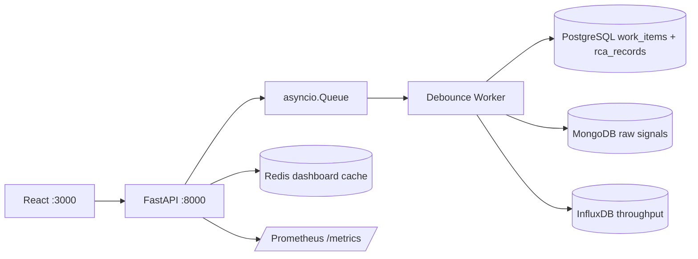

## Quick Start

```bash
git clone https://github.com/Akashranjan15/IMS.git
cd IMS
docker compose up --build
```

- **Frontend:** http://localhost:3000
- **API docs:** http://localhost:8000/docs
- **Health:** http://localhost:8000/health

# Incident Management System

Built this as part of a Zeotap SRE internship assignment. The idea is to simulate how a real ops team would handle a flood of error signals from different infrastructure components.

## Architecture

ASCII fallback (renders in all PDF viewers):

```text
+------------------+       +-------------------+
|  React :3000     |------>|  FastAPI :8000     |
+------------------+       +-------------------+
                                    |
                    +---------------+---------------+
                    |               |               |
             asyncio.Queue    Redis Cache     /metrics
                    |         (hot-path)    (Prometheus)
                    v
            Debounce Worker
            (per-component
             asyncio.Lock)
                    |
        +-----------+-----------+
        |           |           |
  PostgreSQL     MongoDB     InfluxDB
  (work_items    (raw        (throughput
   + rca)        signals)     metrics)
```



## Run

The Compose file includes a demo JWT for local development. To generate your own token:

```bash
cd IMS/backend
python -c "from services.auth import create_access_token; print(create_access_token(expires_minutes=525600))"
```

Start the stack:

```bash
cd IMS
IMS_DEMO_TOKEN="<paste-token-here>" docker compose up --build
```

For a quick local run with the bundled demo token:

```bash
cd IMS
docker compose up --build
```

Open the frontend at `http://localhost:3000` and the API at `http://localhost:8000`.

## Backpressure

I went with FastAPI because it handles async really well. The debounce logic took a while to get right - basically `POST /api/ingest` validates the request and tries a non-blocking `put_nowait` into an `asyncio.Queue` sized at 50,000 items. If the queue is full, the API returns `429` immediately. Slow database writes are absorbed by the queue while the debounce worker retries writes with `tenacity`.

The debounce worker uses per-component `asyncio.Lock` instances to prevent races while counting signals. If 100 or more signals arrive for the same component within 10 seconds, exactly one PostgreSQL work item is created for that debounce window and raw MongoDB signal documents are linked to it.

## Security

- **Demo JWT token**: The bundled token in docker-compose.yml is for local development only. Generate a fresh token before any real deployment (see Run section above).
- JWT authentication protects all `/api/*` routes. SlowAPI rate limiting applies `1000/minute` per source IP on ingestion. CORS is restricted with `IMS_ALLOWED_ORIGINS`. `X-Request-ID` tracing is echoed on every response. RCA validation enforces required fields, minimum text lengths, and valid incident time windows. Docker secrets are environment-driven and should be changed before production deployment.

## API

- `POST /api/ingest`
- `GET /api/incidents`
- `GET /api/incidents/{id}`
- `PATCH /api/incidents/{id}/status`
- `POST /api/incidents/{id}/rca`
- `GET /health`
- `GET /metrics`

Use the JWT as:

```bash
Authorization: Bearer <token>
```

## Simulate Failures

Install simulator dependencies locally or run from the backend container environment:

```bash
cd IMS
pip install httpx
python simulate_failure.py
```

The script sends 150 `RDBMS_PRIMARY_01` signals, which creates one P0 incident. It also sends 120 `MCP_HOST_02` signals, which crosses the 100-signal debounce threshold and creates another incident. Progress is printed every 10 signals.

## Tests

```bash
cd IMS/backend
pytest
```

The included tests cover RCA validation rules. Nothing fancy but they catch the main edge cases.

## Production Notes

Replace default passwords, JWT secret, and InfluxDB token. Run FastAPI with multiple workers behind a load balancer only after moving the debounce queue to a shared broker such as Redis Streams, Kafka, or RabbitMQ. Add TLS termination, centralized log shipping, and Prometheus scraping in the deployment platform. Tune PostgreSQL, MongoDB, Redis, and InfluxDB retention according to incident volume.