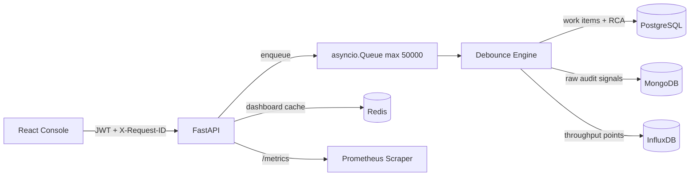
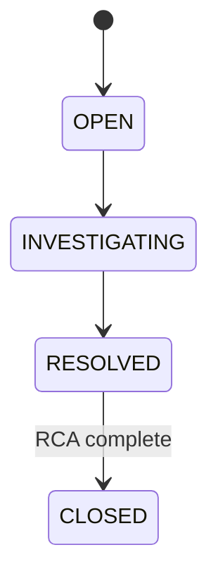

# IMS Architecture

## Flow

1. `/api/ingest` validates a signal, applies IP rate limiting, and places it on an in-process `asyncio.Queue`.
2. The debounce worker groups signals by `component_id` with per-component `asyncio.Lock` protection.
3. When at least 100 signals arrive in 10 seconds, the worker creates one PostgreSQL work item and links the raw MongoDB signal documents to that item.
4. Incident state transitions happen transactionally in PostgreSQL using the State pattern.
5. Redis caches the incident list for 30 seconds and is invalidated on incident creation, status updates, or RCA writes.
6. InfluxDB receives signal throughput points every 5 seconds.

## State Machine

`CLOSED` is blocked unless the incident has a complete RCA with all required fields.

